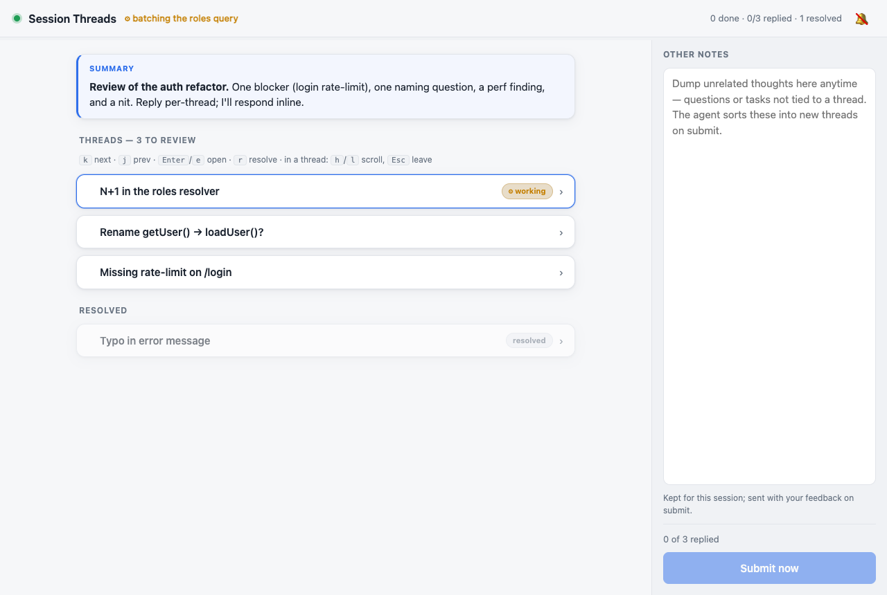
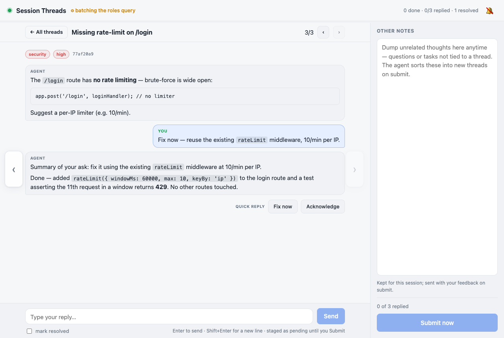

# mcp-session-threads

An [MCP](https://modelcontextprotocol.io) server that turns an agent's **review and decision loops** into a **browser board of threads** you answer at your own pace — instead of a wall of text in the terminal.

When an agent has several findings, questions, or decisions for you, it posts each as its own **thread** on a local web board. You reply per‑thread with quick‑reply buttons or free text, dump unrelated thoughts in a side notes rail, and submit once. The agent picks up your batched feedback and responds — all on one **stable local URL**, with a **fresh board per project**.





## Why

You're deep in **one** Claude Code session and the work piles up:

- you spot **several improvement ideas** at once and don't want to fork a separate session for each;
- the agent hands you **~30 review findings** to work through together;
- juggling **multiple sessions** is a chore — and parallel agents happily crash into each other's work.

The fix is **one system, one context window** — but with each thread shown as its **own chat**, so it stays easy to keep track. You answer threads independently, at your own pace, and **send your feedback back in batches**. The agent keeps working in a single session; nothing forks, nothing collides, nothing gets lost in the scrollback.

## Install

Requires **Node ≥ 18**. No global install needed — run it with `npx`.

### Claude Code

```bash
claude mcp add session-threads -- npx -y mcp-session-threads
```

### Any MCP client

Point your client at the command `npx -y mcp-session-threads` (stdio transport). Or install globally:

```bash
npm i -g mcp-session-threads
mcp-session-threads   # this is the stdio MCP server
```

The first tool call prints the board URL — open it in your browser (default `http://127.0.0.1:4517/b/<id>`).

## How it works

Two processes, auto‑managed:

- **MCP server** (`mcp-session-threads`, stdio) — one per client session. Exposes the tools below.
- **Daemon** (auto‑started on first use) — one long‑lived HTTP server on a fixed port hosting **many boards** and the web UI. It **persists**, so a board's URL never moves between restarts.

Each session resolves a **stable board by key** (the working directory by default), so:

- the URL is the same across restarts for a given project,
- concurrent sessions in different projects get **separate** boards,
- no drift, no cross‑session bleed‑over.

Boards are stored as JSON under `~/.session-threads/boards`.

## Web board

- **Command‑center list** of collapsed threads (newest first); click one to open it full‑screen as a chat.
- **Markdown** in bodies/messages — code, tables, lists, links — rendered safely (HTML escaped, `javascript:` links neutralised).
- **Freestyle tags** (`high`, `security`, `question`, …) shown as auto‑coloured badges.
- **Quick replies** inline in the chat; a click stages the reply as an editable **pending** bubble. Your drafts persist in the browser until you submit.
- **Other notes** rail, always open, for thoughts unrelated to any thread — each submission is preserved.
- **Progress**: a top bar + browser‑title `x/y`, plus an optional per‑board finish **sound**.
- **Keyboard**: `k`/`j` next/prev thread, `Enter`/`e` open or reply, `h`/`l` scroll, `r` resolve, `Esc` leave.

## Tools

| Tool | Purpose |
| --- | --- |
| `create_thread(title, body?, tags?, actions?)` | Open a thread (Markdown body, freestyle tags, tailored quick‑reply buttons). |
| `add_message(thread_id, text, actions?, tags?)` | Append an agent message; reopens a resolved thread. |
| `resolve_thread` / `reopen_thread` | Mark a thread done / reopen it. |
| `list_threads(include_resolved?)` | Reconcile board state. |
| `set_summary(text)` | Pin an overall TL;DR at the top of the board. |
| `get_board_url()` | The stable board URL to share with the user. |
| `wait_for_feedback(timeout_seconds?)` | One long‑blocking call that returns the user's batched replies + notes. |
| `get_notes()` | All durable "other notes" submissions. |
| `start_working` / `work_on_thread` / `mark_thread_done` / `finish_working` | Share progress (shown live in the UI). |
| `list_boards` / `use_board` / `import_threads` / `export_board` / `backup_board` | Board management & recovery. |

Failed calls **throw** — the agent never falsely reports a write that didn't land.

## Configuration

All optional, via environment variables:

| Variable | Default | Meaning |
| --- | --- | --- |
| `SESSION_THREADS_PORT` | `4517` | Daemon port. |
| `SESSION_THREADS_HOST` | `127.0.0.1` | Daemon host. |
| `SESSION_THREADS_DATA_DIR` | `~/.session-threads/boards` | Where boards are persisted. |
| `SESSION_THREADS_BOARD_KEY` | current working directory | Stable board identity for the session. |
| `SESSION_THREADS_LABEL` | derived from the key | Human label shown on the boards index. |

## Development

```bash
npm install
npm test        # node --test: unit (store, feedback, markdown), HTTP integration, and MCP e2e
npm run daemon  # run the HTTP daemon directly
```

Architecture (`src/`): `board-store.js` (model + persistence, event‑emitting), `feedback.js` (long‑poll hub), `http-server.js` (REST + SSE + static), `client.js` (resilient daemon client), `tools.js` (MCP tool wiring), `mcp.js` / `daemon.js` (entry points). The Markdown renderer (`public/markdown.js`) is shared by the UI and the tests.

## License

MIT
